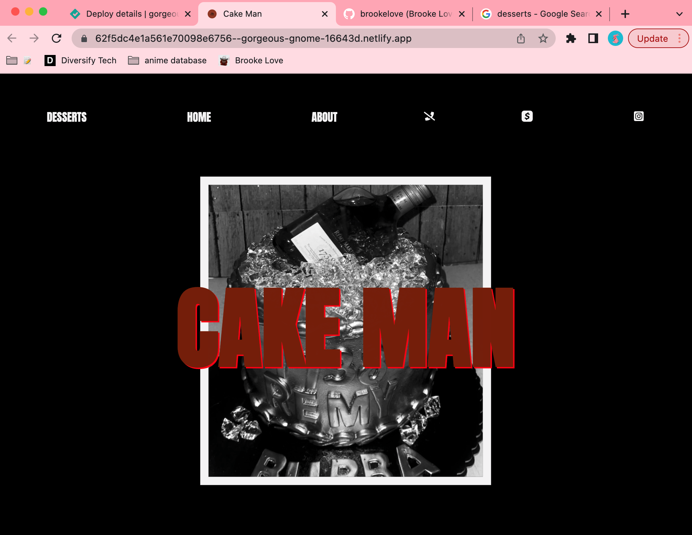
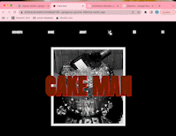

## Cake Man

## Table of Contents

1. [Description](#descript)

2. [Motivation](#motivation)

3. [Usage](#usage)

4. [Mock Up](#mock-up)

5. [Future](#future)

6. [Liscense](#license)

7. [Contributors](#contributors)

8. [Questions](#questions)

# Description

SO thi sis my first project that I have completed for someone else> It was created for my uncle Jason to run his cake business. He makes crazy cakes thate are inventive and creative. I created this with the intention of cool relazed vibe with not that many flashy colors other than the cakes, which speak for themselves.

# Motivation

    I wanted to create a website that was noton commision for someone else to connect with clients on a different basis. After completing my bootcamp I wanted to test myself on creativity as well as see what it would be like to work for someone else. It allowed me to showcase what I was and am completing currently.

# Usage

    use this app for a client to showcase their work and navigate to qick links.

# Mock Up

<!--  -->

# Future

     I would like to intergrate the animated title to happen everytime you click on teh homescreen and it scrolls to the top of the page. I think I also want to create a way for when the sticky bar scrolls down it changes colors to reflect a difference betwen the bar and the page. I think I would also like to figure out how to import 

# License

[MIT](./LICENSE)

# Contributors

    I did not have any help contribute to this project and would not want any contributors in the future.

# Questions?

Feel Free to reach me at!

- [brookelovedevelops@gmail.com](brookelovedevelops@gmail.com)

- [brookelove Profile](!https://github.com/brookelove)
